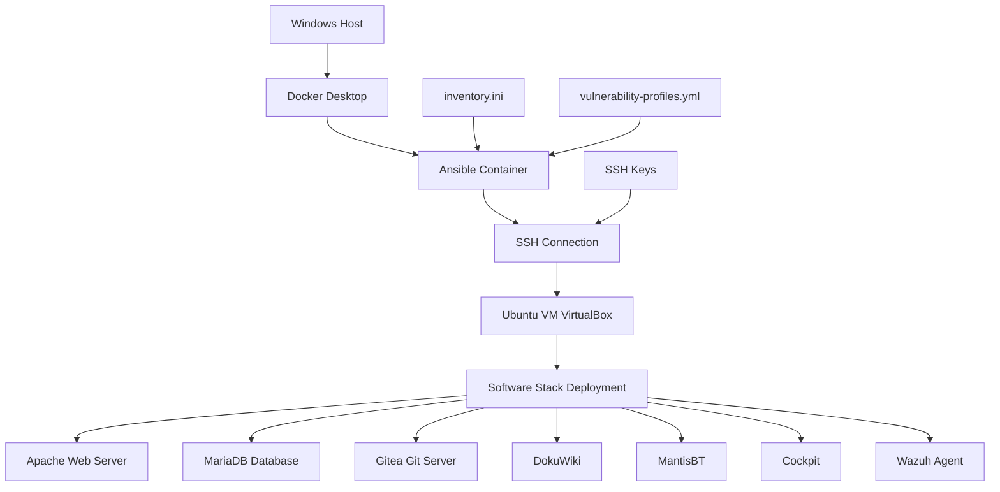

# Ansible Playbook Technical Documentation
## 01_clean_image_base.yml - Complete Architecture Guide

---

## Overview

The `01_clean_image_base.yml` playbook is the core component of our vulnerable lab environment setup. It orchestrates the deployment of a complete software stack with configurable vulnerability profiles across a containerized Ansible control node to a target Ubuntu system via SSH.

## Architecture Flow



---

## Connection Architecture

### 1. **Docker Container to Host Communication**

```yaml
# inventory.ini connection configuration
[vps_lab]
vps_target ansible_host=host.docker.internal ansible_user=noah ansible_port=2222

[all:vars]
ansible_become=yes
ansible_become_password=ColdBrew
ansible_private_key_file=/ansible/Keys/vps_key
```

**Technical Details:**
- **`host.docker.internal`**: Docker's internal DNS name that resolves to the Windows host machine
- **Network Flow**: Container → Docker Bridge → Windows Host → VirtualBox NAT → Ubuntu VM
- **Port Mapping**: Windows Host:2222 → Ubuntu VM:22 (SSH)

### 2. **SSH Authentication Chain**

```
┌─────────────────┐    ┌──────────────────┐    ┌─────────────────┐
│ Ansible Container│    │   Windows Host   │    │   Ubuntu VM     │
│                 │    │                  │    │                 │
│ /ansible/Keys/  │────┤ VirtualBox NAT   │────┤ ~/.ssh/         │
│ vps_key         │    │ Port Forward     │    │ authorized_keys │
│ (Private Key)   │    │ 2222 → 22        │    │ (Public Key)    │
└─────────────────┘    └──────────────────┘    └─────────────────┘
```

**Authentication Process:**
1. Ansible container mounts SSH key from Windows host: `-v D:\ansible-control-node:/ansible`
2. Container sets key permissions: `chmod 600 /ansible/Keys/vps_key`
3. SSH connection established: `ansible_host=host.docker.internal:2222`
4. Key-based authentication to Ubuntu VM user `noah`
5. Privilege escalation via sudo: `ansible_become_password=ColdBrew`

---

## Playbook Structure Analysis

### 1. **Variable Management & Version Control**

```yaml
vars:
  # Database Configuration
  mysql_root_password: "CleanLabPassword123!"
  
  # Software Versions (for vulnerability testing)
  apache_version: "latest"              # Options: "latest", "2.4.41" (CVE-2019-0211)
  php_version: "latest"                 # Options: "latest", "7.4", "7.3" (multiple CVEs)
  gitea_version: "1.17.3"              # Options: "1.21.0" (latest), "1.17.3" (CVE-2022-4188)
  dokuwiki_version: "2020-07-29"       # Options: "stable", "2020-07-29" (CVE-2020-25790)
  wazuh_version: "4.3.10"              # Options: "4.7.0" (latest), "4.3.10" (older)
```

**Version Management Logic:**
- **Dynamic Version Selection**: Uses Jinja2 templating for conditional package installation
- **Vulnerability Profiles**: Integrates with `vulnerability-profiles.yml` for scenario-based deployments
- **Upgrade/Downgrade Handling**: Automated cleanup of existing installations before version changes

### 2. **Inventory Integration**

```yaml
# Playbook Header
- name: 01 - Create the Clean Base Lab Image with Complete Software Stack
  hosts: vps_lab                    # References inventory group
  gather_facts: yes                 # Collects system information
  vars:                            # Playbook-specific variables
```

**Inventory Connection Process:**
1. **Group Targeting**: `hosts: vps_lab` targets the inventory group defined in `inventory.ini`
2. **Host Resolution**: Ansible resolves `vps_target` → `host.docker.internal:2222`
3. **Fact Gathering**: Collects Ubuntu system information for conditional logic
4. **Variable Inheritance**: Merges playbook vars with inventory vars

---

## Docker Integration Deep Dive

### 1. **Container Execution Model**

```powershell
# Docker run command breakdown
docker run --rm \                                    # Remove container after execution
  -v D:\ansible-control-node:/ansible \             # Mount Windows directory
  ansible-control-node \                            # Use built container image
  sh -c "chmod 600 /ansible/Keys/vps_key && \       # Set SSH key permissions
         ansible-playbook /ansible/playbooks/01_clean_image_base.yml \
         -i /ansible/inventory.ini"                  # Run playbook with inventory
```

**Container Filesystem Mapping:**
```
Windows Host                    Container
D:\ansible-control-node\   →   /ansible/
├── inventory.ini          →   /ansible/inventory.ini
├── Keys/vps_key          →   /ansible/Keys/vps_key
├── playbooks/            →   /ansible/playbooks/
└── vulnerability-profiles.yml → /ansible/vulnerability-profiles.yml
```

### 2. **Network Communication Flow**

```
[Windows Host] ←→ [Docker Bridge] ←→ [Ansible Container]
       ↓
[VirtualBox NAT Network]
       ↓
[Ubuntu VM:22] ←← SSH Connection via port 2222 ←← [Container]
```

**Network Layers:**
1. **Docker Bridge Network**: Internal container-to-host communication
2. **Windows Host Network**: VirtualBox port forwarding rules
3. **VirtualBox NAT**: VM network isolation with selective port forwarding
4. **Ubuntu VM Network**: Target system receiving Ansible management

---

## Software Stack Deployment Process

### 1. **Infrastructure Layer**

```yaml
# System Updates and Base Packages
- name: Ensure the system is updated
  ansible.builtin.apt:
    upgrade: dist
    update_cache: yes

- name: Install base required packages
  ansible.builtin.apt:
    name:
      - git, curl, wget, unzip
      - apt-transport-https, ca-certificates
      - python3-apt, python3-pymysql    # Ansible dependencies
```

**Purpose**: Establishes secure, updated foundation with Ansible module dependencies

### 2. **Web Server Stack**

```yaml
# Apache + PHP Installation with Version Control
- name: Install Apache HTTP Server and PHP modules
  ansible.builtin.apt:
    name:
      - apache2
      - "phpphp{{ php_version }}"
      - "php-mysqlphp{{ php_version }}-mysql"
```

**Technical Implementation:**
- **Conditional Installation**: Jinja2 templating for version-specific package names
- **Service Management**: Automated start/enable with systemd integration
- **Configuration Management**: ServerName, modules, virtual hosts

### 3. **Database Layer**

```yaml
# MariaDB with Version-Specific Repository Management
- name: Add MariaDB repository for specific versions (if not latest)
  block:
    - name: Install MariaDB repository key
    - name: Add MariaDB repository
    - name: Update apt cache for MariaDB
  when: mysql_version != "latest"
```

**Database Setup Process:**
1. **Repository Management**: Conditional repository addition for specific versions
2. **Installation**: Version-controlled MariaDB server and client
3. **Security Configuration**: Root password, anonymous user removal, test database cleanup
4. **Application Databases**: Automated creation for Gitea, MantisBT

### 4. **Application Deployment**

#### **Gitea Git Server**
```yaml
- name: Remove existing Gitea binary        # Cleanup for version changes
- name: Download Gitea binary
  get_url:
    url: "https://dl.gitea.io/gitea/{{ gitea_version }}/gitea-{{ gitea_version }}-linux-amd64"
    dest: /usr/local/bin/gitea
    force: yes                              # Force download for version changes
```

#### **DokuWiki Wiki System**
```yaml
- name: Remove existing DokuWiki installation
- name: Download DokuWiki
- name: Extract DokuWiki
- name: Find DokuWiki extracted directory     # Handle version-specific directory names
- name: Rename DokuWiki directory to standard location
```

#### **MantisBT Bug Tracker**
```yaml
- name: Remove existing MantisBT installation
- name: Find MantisBT extracted directory
  find:
    paths: /var/www/
    patterns: "mantisbt-*"
    file_type: directory
- name: Rename MantisBT directory
  command: mv "{{ mantisbt_dirs.files[0].path }}" /var/www/mantisbt
```

### 5. **System Services**

#### **Postfix Mail Server**
```yaml
- name: Configure Postfix main.cf
  lineinfile:
    path: /etc/postfix/main.cf
    regexp: '^{{ item.key }}.*'
    line: '{{ item.key }} = {{ item.value }}'
  loop:
    - { key: 'myhostname', value: 'lab.local' }
    - { key: 'mydomain', value: 'lab.local' }
```

#### **Wazuh Security Agent**
```yaml
- name: Stop Wazuh agent service if running
- name: Remove existing Wazuh agent installation
- name: Install Wazuh agent (specific version if not latest)
  ansible.builtin.apt:
    name: "wazuh-agentwazuh-agent={{ wazuh_version }}-*"
    allow_downgrade: yes                    # Critical for version management
```

### 6. **Web Server Proxy Configuration**

```yaml
# Apache Proxy Modules for Service Integration
- name: Enable Apache proxy modules
  apache2_module:
    name: "{{ item }}"
  loop: [proxy, proxy_http, proxy_wstunnel]

# Gitea Proxy Configuration
- name: Create Gitea proxy configuration
  copy:
    content: |
      <VirtualHost *:80>
          ProxyPass /gitea/ http://localhost:3000/
          ProxyPassReverse /gitea/ http://localhost:3000/
      </VirtualHost>
```

**Proxy Architecture Purpose:**
- **Port Consolidation**: Access all services through port 80 (VirtualBox forwarded to 8080)
- **Service Integration**: Seamless access without additional port forwarding
- **WebSocket Support**: Real-time features for Gitea and Cockpit

---

## Error Handling and Idempotency

### 1. **Service Cleanup Strategy**

```yaml
# Pattern used throughout playbook
- name: Stop [Service] service if running
  systemd:
    name: [service-name]
    state: stopped
  ignore_errors: yes

- name: Remove existing [Service] installation
  apt:
    name: [package-name]
    state: absent
    purge: yes
  ignore_errors: yes
```

**Benefits:**
- **Clean State Management**: Ensures consistent deployments
- **Version Change Support**: Enables downgrades and upgrades
- **Idempotent Operations**: Multiple playbook runs produce same result

### 2. **Conditional Execution**

```yaml
# Repository management example
- name: Add MariaDB repository for specific versions (if not latest)
  block:
    - name: Install MariaDB repository key
    - name: Add MariaDB repository  
  when: mysql_version != "latest"
```

**Logic Implementation:**
- **Version-Based Conditions**: Different installation paths for latest vs. specific versions
- **Block Operations**: Grouped tasks with shared conditions
- **Failure Handling**: `ignore_errors: yes` for cleanup operations

### 3. **Directory and File Management**

```yaml
# Dynamic directory handling
- name: Find DokuWiki extracted directory
  find:
    paths: /var/www/
    patterns: "dokuwiki-*"
    file_type: directory
  register: dokuwiki_dirs

- name: Rename DokuWiki directory to standard location
  command: mv "{{ dokuwiki_dirs.files[0].path }}" /var/www/dokuwiki
  when: dokuwiki_dirs.files | length > 0
```

---

## Security Implementation

### 1. **Privilege Escalation**

```yaml
# Playbook header
hosts: vps_lab
become: yes                    # Enable privilege escalation
become_method: sudo           # Use sudo for privilege escalation

# Inventory configuration
ansible_become_password=ColdBrew    # Sudo password for automated escalation
```

### 2. **SSH Security**

```yaml
# Inventory SSH configuration
ansible_private_key_file=/ansible/Keys/vps_key    # Key-based authentication
host_key_checking=False                           # Automated host acceptance
ansible_ssh_common_args='-o StrictHostKeyChecking=no'
```

**Security Considerations:**
- **Key-Based Authentication**: More secure than password authentication
- **Disabled Host Checking**: Convenience vs. security trade-off for lab environment
- **Container Isolation**: SSH keys isolated within container environment

### 3. **Firewall Configuration**

```yaml
- name: Ensure UFW firewall is active
  community.general.ufw:
    state: enabled

- name: Open required ports in firewall
  community.general.ufw:
    rule: allow
    port: "{{ item }}"
  loop:
    - '22'     # SSH
    - '80'     # HTTP
    - '443'    # HTTPS
    - '3000'   # Gitea
    - '9090'   # Cockpit
```

---

## Troubleshooting Integration

### 1. **Verbose Execution**

```powershell
# Add -v flag for detailed output
docker run --rm -v D:\ansible-control-node:/ansible ansible-control-node sh -c \
  "chmod 600 /ansible/Keys/vps_key && \
   ansible-playbook /ansible/playbooks/01_clean_image_base.yml \
   -i /ansible/inventory.ini -v"
```

### 2. **Selective Task Execution**

```powershell
# Start from specific task
--start-at-task='Download Gitea binary'

# Run specific tasks with tags
--tags="web,database"
```

### 3. **Connection Testing**

```yaml
# Built-in connectivity verification
- name: Gathering Facts
  # Automatically tests SSH connection and collects system information
```

---

## Performance Considerations

### 1. **Parallel Execution**

```yaml
# Multiple packages in single task
- name: Install Apache HTTP Server and PHP modules
  ansible.builtin.apt:
    name:
      - apache2
      - php
      - php-mysql
```

### 2. **Efficient Downloads**

```yaml
# Conditional downloads with force parameter
- name: Download Gitea binary
  get_url:
    url: "https://dl.gitea.io/gitea/{{ gitea_version }}/gitea-{{ gitea_version }}-linux-amd64"
    dest: /usr/local/bin/gitea
    force: yes        # Only download if version changed
```

### 3. **Caching Strategy**

```yaml
# APT cache management
- name: Update apt cache for MariaDB
  apt:
    update_cache: yes
    cache_valid_time: 3600    # Cache valid for 1 hour
```

---

## Integration Points

### 1. **Vulnerability Profiles Integration**

```yaml
# External configuration file integration
# vulnerability-profiles.yml defines version combinations
# Playbook variables can be overridden by profile selection
```

### 2. **PowerShell Script Integration**

```powershell
# run_clean.ps1 wrapper script
.\run_clean.ps1                                    # Simple execution
.\run_vulnerability_profile.ps1 -Profile "vulnerable"    # Profile-based execution
```

### 3. **Service Discovery**

```yaml
# Landing page generation with service URLs
- name: Create lab environment landing page
  copy:
    content: |
      # Dynamic HTML with service links and version information
    dest: /var/www/html/index.html
```

---

## Conclusion

The `01_clean_image_base.yml` playbook represents a sophisticated infrastructure-as-code implementation that:

1. **Abstracts Complexity**: Simplifies multi-service deployment through automation
2. **Enables Flexibility**: Supports multiple vulnerability scenarios through version management
3. **Ensures Consistency**: Idempotent operations guarantee reproducible environments
4. **Integrates Seamlessly**: Works within containerized control node architecture
5. **Handles Edge Cases**: Comprehensive error handling and cleanup strategies

This architecture enables security professionals to rapidly deploy and manage vulnerable lab environments for penetration testing, security training, and vulnerability research while maintaining isolation and reproducibility.

---

**Document Version**: 1.0  
**Last Updated**: October 2, 2025  
**Compatibility**: Ansible 2.19, Ubuntu 24.04.3 LTS, Docker Desktop with WSL2