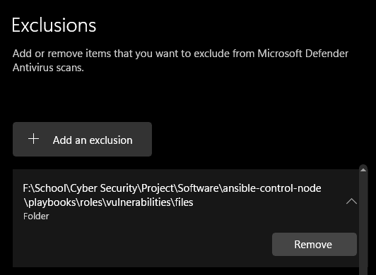

# Quick Start Guide - Ansible Lab Environment

**Welcome!** This guide will get you up and running with the Ansible Lab Environment in under 10 minutes.

## 📋 What You'll Get

After completing this guide, you'll have:
- ✅ Fully automated Ubuntu VM for security labs
- ✅ One-command deployment of lab environments
- ✅ Instant VM reset capability via snapshots
- ✅ Clean or vulnerable configurations at your fingertips

---

## 🎯 Prerequisites

### Required Software

1. **Git** - Version control
   - Windows: https://git-scm.com/download/win
   - Already installed on most Linux/macOS systems

2. **Docker Desktop** - Runs Ansible control node
   - Windows/Mac: https://www.docker.com/products/docker-desktop
   - Linux: Install via package manager

3. **Vagrant** - Automates VM creation
   - All platforms: https://www.vagrantup.com/downloads

4. **VirtualBox** - VM platform
   - All platforms: https://www.virtualbox.org/wiki/Downloads

### System Requirements

- **RAM**: 4GB minimum (6GB+ recommended)
- **Disk Space**: 20GB free
- **OS**: Windows 10+, macOS 10.14+, or modern Linux
- **CPU**: Virtualization enabled in BIOS

---

## 🚀 Setup Steps

### Step 1: Clone the Repository

```powershell
# Windows PowerShell
cd D:\  # Or your preferred location
git clone https://github.com/NoahGram/ansible-control-node.git
cd ansible-control-node
```

```bash
# Linux/macOS
cd ~/  # Or your preferred location
git clone https://github.com/NoahGram/ansible-control-node.git
cd ansible-control-node
```

### Step 1.1: Make sure that the neofetch RAT file is not detected by your antivirus software.
If it is detected, please whitelist the file or disable your antivirus software temporarily during the setup process.

For windows users specifically, please ensure that Windows Defender does not quarantine the neofetch RAT file. You can do this by adding an exclusion for the file in Windows Defender settings. Like this:

1. Open Windows Security.
2. Go to "Virus & threat protection".
3. Click on "Manage settings" under "Virus & threat protection settings".
4. Scroll down to "Exclusions" and click on "Add or remove exclusions".
5. Click on "Add an exclusion" and select "Folder".
6. Browse to the location of the folder where the neofetch RAT file is and select it to add the exclusion.



This will make sure that the neofetch RAT file is not blocked during the setup and operation of the Ansible Control Node. If it does occur that the file is deleted or quarantined, you could either redownload it from the repository or use git to restore it. By doing:

```bash
# Inside of the ansible-control-node directory
git restore .
```
---

### Step 2: Configure Your Environment

**Create `.env` file from template:**

```powershell
# Windows
Copy-Item .env.example .env
```

```bash
# Linux/macOS
cp .env.example .env
```

**Edit `.env` file** (use any text editor):

```bash
# REQUIRED: Set your repository path
ANSIBLE_CONTROL_NODE_PATH=D:/ansible-control-node  # Windows
# OR
ANSIBLE_CONTROL_NODE_PATH=/home/username/ansible-control-node  # Linux/macOS

# REQUIRED: Set platform to Vagrant
VM_PLATFORM=vagrant

# OPTIONAL: Vagrant-specific settings (have sensible defaults)
# VAGRANT_SNAPSHOT_NAME=base
# VM_NAME=ansible-control-node-acs-001

# OPTIONAL: VM connection settings (auto-default when VM_PLATFORM=vagrant)
# Only uncomment these if you need to override the defaults:
# VM1_USERNAME=vagrant
# VM1_HOSTNAME=host.docker.internal
# VM1_SSH_PORT=2222
# VM1_SSH_KEY_PATH=Keys/vps_key
```

**That's it for initial configuration!** The rest auto-configures.

---

### Step 3: Build Ansible Control Node

Build the Docker image that runs Ansible:

```powershell
# Windows
.\setup.ps1
```

```bash
# Linux/macOS
./setup.sh
```

**Time**: ~2-3 minutes (includes Docker build)

**What happens:**
1. Checks Docker, Vagrant, VirtualBox are installed
2. Verifies .env file exists
3. Builds `ansible-control-node` Docker image
4. Shows next steps

**Expected Output:**
```
============================================
 Environment Checks
============================================
✓ Docker found: Docker version 28.4.0
✓ Vagrant found: Vagrant 2.4.0
✓ VirtualBox found: 7.0.x
✓ .env file found

============================================
 Building Ansible Control Node
============================================
Building Docker image 'ansible-control-node'...
[Docker build output...]
✓ Docker image built successfully!

============================================
 Setup Complete!
============================================
Next Steps:
1. Create VM: vagrant up
2. Create snapshot: vagrant snapshot save base
3. Deploy lab: .\scripts\run_clean.ps1
```

---

### Step 4: Create the VM with Vagrant

```powershell
# All platforms
vagrant up
```

**Time**: ~5 minutes (first time includes box download)

**What happens:**
- Downloads Ubuntu 24.04 base box (first time only, ~2 min)
- Creates VM with proper resources (2GB RAM, 2 CPUs)
- Configures networking and port forwarding
- Installs SSH server
- Sets up firewall (UFW)
- Installs your SSH keys
- Installs Python for Ansible

**Expected Output:**
```
Bringing machine 'default' up with 'virtualbox' provider...
==> default: Importing base box 'bento/ubuntu-24.04'...
==> default: Forwarding ports...
    default: 22 (guest) => 2222 (host)
    default: 80 (guest) => 8080 (host)
==> default: Running provisioner: shell...
==> default: Base System Provisioning Complete!
==> default: SSH Server: Active
==> default: UFW Firewall: Enabled
```

---

### Step 5: Create Base Snapshot

```powershell
# All platforms
vagrant snapshot save base
```

**Time**: ~10 seconds

This creates a clean snapshot you can instantly restore to.

**📝 Note:** You don't need to create `inventory.ini` manually! The deployment scripts automatically generate it from your `.env` file before running Ansible.

---

### Step 6: Test Connection

```powershell
# Windows
.\scripts\test_connection.ps1
```

```bash
# Linux/macOS
./scripts/test_connection.sh
```

**Expected output:**
```
============================================
 Testing VM Connection
============================================
Target: vagrant@host.docker.internal:2222
Connection successful

============================================
 SUCCESS! VM is reachable
============================================
```

✅ **If you see "SUCCESS"**, you're ready to deploy!

---

## 🎮 Daily Usage

### Deploy Clean Lab Environment

**📝 Note:** The script automatically generates `inventory.ini` from your `.env` file before deploying. No manual inventory creation needed!

**Credentials:** 
- Username: vagrant
- Password: vagrant

```powershell
# Windows
.\scripts\run_clean.ps1
```

```bash
# Linux/macOS
./scripts/run_clean.sh
```

**Time**: ~3-5 minutes

**What gets installed:**
- ✅ Apache web server
- ✅ PHP 8.x
- ✅ MariaDB database
- ✅ Gitea (Git server)
- ✅ LabSys Wiki
- ✅ Cockpit (web-based management)
- ✅ All properly secured

---

### Deploy Vulnerable Lab (Security Training)

```powershell
# Windows
.\scripts\run_vulnerable.ps1
```

```bash
# Linux/macOS
./scripts/run_vulnerable.sh
```

**Adds intentional vulnerabilities for training:**
- SQL injection vulnerabilities
- Weak passwords
- Insecure configurations
- Command injection points

⚠️ **WARNING**: Only use on isolated lab networks!

---

### Reset VM to Clean State

```powershell
# Windows
.\scripts\reset_vm.ps1
```

```bash
# Linux/macOS
./scripts/reset_vm.sh
```

**Time**: ~30 seconds

Restores VM to the `base` snapshot - instant clean state!

---

### Access Your Services

After deployment, access services in your browser:

| Service | URL | Purpose |
|---------|-----|---------|
| **LabSys Wiki** | http://localhost:8080/labsys-wiki/ | Main wiki portal |
| **Gitea** | http://localhost:3000/ | Git repository server |
| **Cockpit** | https://localhost:9090/ | System management |

**SSH Access:**
```bash
ssh -i Keys/vps_key -p 2222 vagrant@host.docker.internal
# Or simply: vagrant ssh
```

**Login Credentials:**
- **Cockpit Web Interface**
  - URL: https://localhost:9090/
  - Username: `vagrant`
  - Password: Your `VM1_PASSWORD` from `.env` file (default: check your `.env`) (<-- Outdated, Current Password: vagrant)
  
- **SSH Access**
  - Key-based authentication (no password needed)
  - Or use: `vagrant ssh` for direct access

---
ssh -i Keys/vps_key -p 2222 vagrant@host.docker.internal
```

Or simply:
```bash
vagrant ssh
```

---

## 🔄 Common Workflows

### Full Clean Deployment
```powershell
.\scripts\reset_vm.ps1       # Reset to clean state
.\scripts\run_clean.ps1      # Deploy clean lab
```

### Test Security Vulnerabilities
```powershell
.\scripts\reset_vm.ps1       # Reset to clean state
.\scripts\run_vulnerable.ps1 # Deploy vulnerable config
# Test your exploits...
.\scripts\reset_vm.ps1       # Reset when done
```

### Quick Fresh Start
```powershell
.\scripts\fresh_install_test.ps1  # Reset + Deploy in one command
```

---

## 📊 Understanding Ansible Output

When you run deployment scripts, you'll see Ansible output:

```
TASK [base_system : Update apt cache] ************************************
ok: [vps_target]

TASK [database : Install MariaDB] ****************************************
changed: [vps_target]
```

**Status meanings:**
- `ok` - Task completed, no changes needed (already correct)
- `changed` - Task made modifications
- `failed` - Task encountered an error (❌ problem!)
- `skipped` - Task was skipped (conditional)

**Final summary:**
```
PLAY RECAP ***************************************************************
vps_target : ok=87  changed=55  unreachable=0  failed=0  skipped=12
```
- ✅ `failed=0` means success!
- `changed` number varies (fewer changes = more idempotent)

---

## 🐛 Troubleshooting

### VM Won't Start

**Problem:** `vagrant up` fails

**Solution:**
```powershell
# Check if VirtualBox is running
# Open VirtualBox GUI

# Try destroying and recreating
vagrant destroy -f
vagrant up
```

### SSH Connection Failed

**Problem:** `test_connection.ps1` shows error

**Solution:**
```powershell
# 1. Verify VM is running
vagrant status

# 2. Try SSH via Vagrant
vagrant ssh

# 3. Regenerate inventory
python generate_inventory.py

# 4. Check .env settings
# Make sure VM_PLATFORM=vagrant
```

### Docker Build Fails

**Problem:** `setup.ps1` fails

**Solution:**
```powershell
# Make sure Docker Desktop is running
# Check Docker is accessible:
docker ps

# Try building again
.\setup.ps1
```

### Port Already in Use

**Problem:** Vagrant complains about port collision

**Solution:**
```powershell
# Stop conflicting service
# For example, if port 8080 is in use:
# Stop any local web server on port 8080

# Or edit Vagrantfile to use different port
# Then reload:
vagrant reload
```

### Deployment Fails

**Problem:** `run_clean.ps1` shows errors

**Solution:**
```powershell
# 1. Reset VM to clean state
.\scripts\reset_vm.ps1

# 2. Try deployment again
.\scripts\run_clean.ps1

# 3. If still failing, check Ansible output for specific error
# Look for "FAILED" tasks and their error messages
```

---

## 📚 Next Steps

### Learn More

**Basic Usage:**
- ✅ You're ready! Run `.\scripts\run_clean.ps1` to deploy
- ✅ Access services at http://localhost:8080
- ✅ Reset with `.\scripts\reset_vm.ps1` when needed

**Dive Deeper:**
- 📖 **Vagrant Details**: Read `documentation/Vagrant.md`
- 📖 **Ansible Roles**: Read `documentation/Ansible_Guide.md`

### Customize Your Lab

**Change VM Resources:**
Edit `Vagrantfile`:
```ruby
vb.memory = "4096"  # 4GB RAM instead of 2GB
vb.cpus = 4         # 4 CPUs instead of 2
```

Then:
```powershell
vagrant reload
```

**Modify Applications:**
Edit role files in `playbooks/roles/` and redeploy.

**Add Custom Services:**
Create new Ansible roles following the guide in `documentation/Ansible_Guide.md`.

---

## 🎓 Key Concepts

### The .env File
- **Single source of truth** for all configuration
- Edit once, all scripts adapt automatically
- Not tracked in Git (your personal settings)

### Vagrant
- **Automates VM creation** from code (Vagrantfile)
- **Snapshot support** for instant resets
- **Reproducible environments** across team

### Ansible
- **Configuration management** tool
- **Idempotent** - safe to run multiple times
- **Role-based** - modular, maintainable code

### Docker
- **Runs Ansible control node** in container
- **Consistent execution** environment
- **No local Ansible installation** needed

### Workflow Summary
```
.env → Scripts → Docker (Ansible) → SSH → VM (Ubuntu)
```

1. You edit `.env` once
2. Scripts read `.env` and generate inventory
3. Docker container runs Ansible
4. Ansible connects to VM via SSH
5. Roles configure the VM
6. Services are deployed and started

---

## ✅ Quick Reference

### Essential Commands

```powershell
# VM Management
vagrant up              # Start VM
vagrant halt            # Stop VM
vagrant status          # Check VM status
vagrant ssh             # SSH into VM

# Snapshots
vagrant snapshot save base       # Create snapshot
vagrant snapshot restore base    # Restore snapshot

# Deployment
.\scripts\run_clean.ps1          # Deploy clean lab
.\scripts\run_vulnerable.ps1     # Deploy vulnerable lab
.\scripts\reset_vm.ps1           # Reset VM

# Testing
.\scripts\test_connection.ps1    # Test SSH connectivity
```

### Important Files

- **`.env`** - Your configuration (edit this)
- **`Vagrantfile`** - VM definition
- **`inventory.ini`** - Auto-generated from .env
- **`playbooks/site_clean.yml`** - Main deployment playbook
- **`playbooks/roles/`** - Individual component roles

### Important Directories

- **`scripts/`** - PowerShell/Bash deployment scripts
- **`documentation/`** - Detailed guides
- **`playbooks/`** - Ansible playbooks and roles
- **`Keys/`** - SSH keys (gitignored)

---

## 🆘 Getting Help

### Documentation
- 📖 `documentation/Vagrant.md` - Vagrant guide
- 📖 `documentation/Ansible_Guide.md` - Ansible and roles

### Common Issues
- Check "Troubleshooting" sections in each guide
- Review Ansible output for specific error messages
- Verify `.env` settings are correct

### Online Resources
- [Vagrant Documentation](https://www.vagrantup.com/docs)
- [Ansible Documentation](https://docs.ansible.com/)
- [VirtualBox Manual](https://www.virtualbox.org/manual/)

---